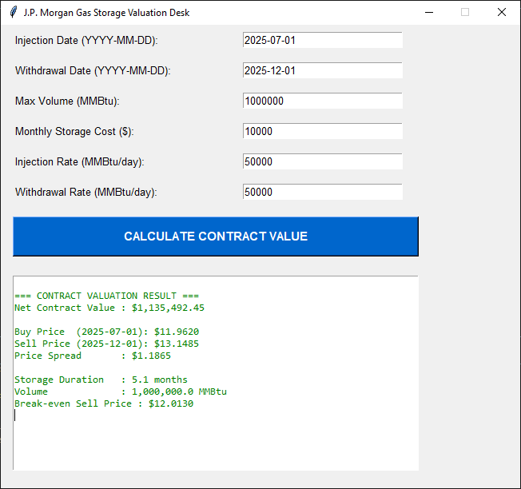

# J.P. Morgan - Natural Gas Storage Pricing Tool

A desktop application to value natural gas storage contracts using historical data and seasonality forecasting.



## Overview
This tool calculates the **net value** of gas storage contracts by comparing purchase and sale prices (with seasonality), storage costs, and operational constraints.

## Features
- Interactive Tkinter GUI
- Price forecasting with linear trend + monthly seasonality
- Real-time contract valuation
- Profitability warnings (red/green) and break-even analysis
- Supports different injection/withdrawal dates and volumes

## How to Run
1. Install dependencies:
   ```bash
   pip install pandas scipy matplotlib 

Make sure nat_gas.csv is in the project folder
Run the application:bash

python main.py

Tech StackPython 3
Pandas, SciPy, Tkinter
